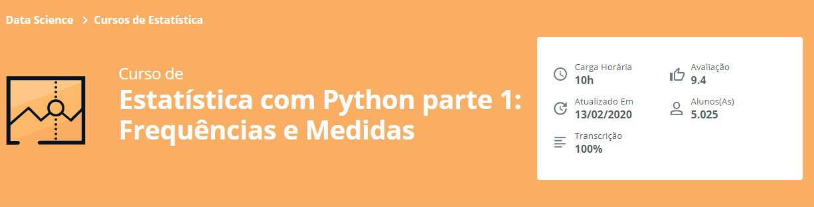

Repositório de desenvolvimento referente ao **Curso de Estatística com Python parte 1: Frequências e Medidas - Alura**

## Aprendido no curso
* Estatística e os números que você lida
* Diferença entre média, mediana e moda na prática
* Tipos de dados e classifique-os
* O que é a distribuição de frequência
* Variância e o desvio padrão

## Link para o Curso 
https://cursos.alura.com.br/course/estatistica-distribuicoes-e-medidas
